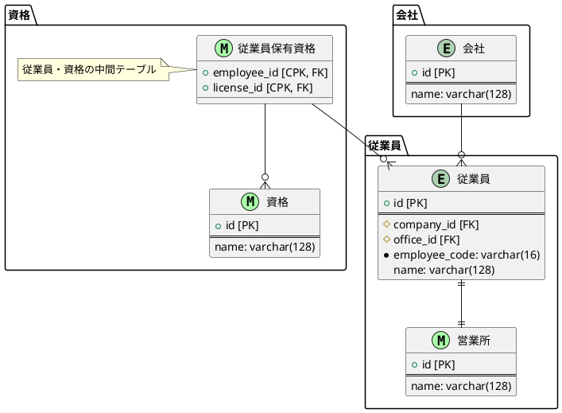

**こんな風に書いたらいいかも**

- PK = \+ Primary Key 主キー
- CPK = \+ Composite Primary Key 複合主キー
- FK = \# Foreign Key 外部キー
- ユニーク制約 = \*

**カーディナリティ**

```
------ :1
----|| :1 and only 1
----o| :0 or 1
-----{ :many
----|{ :1 or more
----o{ :0 or many
```


